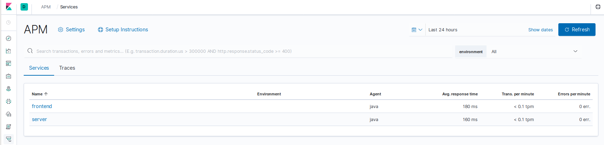
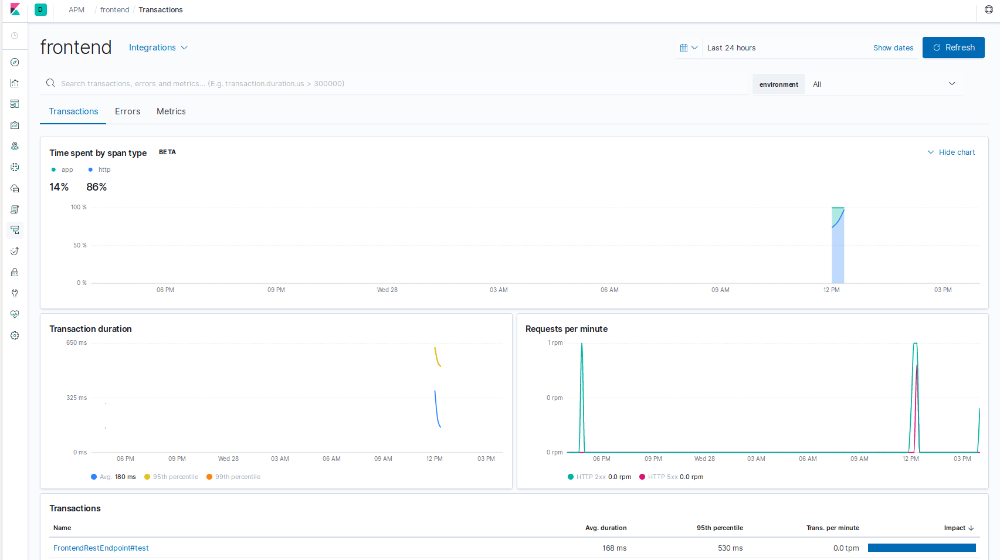
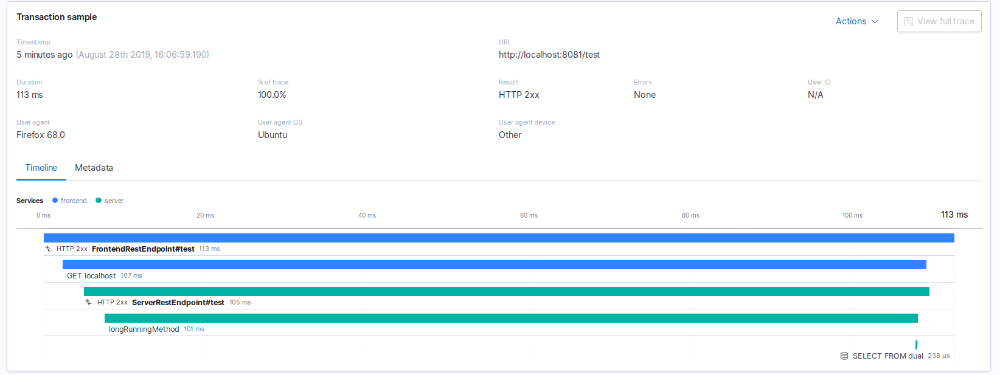

## Purpose of this project

This is short presentation of Elastic APM set up.

### Requirements

 - java 1.8
 - docker
 - docker-compose

### Used tools
 - kibana:7.3.1
 - elasticsearch:7.3.1
 - apm-server:7.3.1
 - apm-agent:1.9.0
 - springboot:2.1.7
 
### How to run

To run infrastructure execute:
```bash
    docker-compose -f infrastructure/docker-compose.yml up -d 
```

To run apps, execute in `server` and `frontend` folders:

```bash
    ./run_app.sh
```

##### Check if everything is running:

Server is available at:
[link](http://localhost:8082/test)

Frontend is available at:
[link](http://localhost:8081/test)

Kibana should be available at [link](http://localhost:5601) with no errors

You can check if infrastructure is in place visiting [kibana apm setup](http://localhost:5601/app/kibana#/home/tutorial/apm?_g=())

Apm page is available at [link](http://localhost:5601/app/apm#/services?rangeFrom=now-24h&rangeTo=now&refreshPaused=true&refreshInterval=0)
Chose frontend and on the bottom of the page select transaction. If no transactions are available visit [frontend](http://localhost:8081/test) 
to generate some traffic and refresh kibana's apm page.

### Available data

 If everything is up and running explore available data.
 
 - Choose `frontend` as a service which stats you will explore
 

 - You can see stats like transaction duration and request per minute charts. Let's explore one of the transactions.
 Choose `FrontendRestEndpoint#test` from transactions list at the bottom of the page
 

 - Have a look on transaction sample at the bottom of the page and it's content
    - services participating in transaction (frontend and server)
    - timeline of transaction
    - custom scope of operation shown on timeline (longRunningMethod)
    - duration of executed sql query (bottom line) and query itself 
    
 


### Troubleshooting
 
 - APM may not be not available after firs start, try:
 ```bash
     docker-compose -f infrastructure/docker-compose.yml restart apm
 ```
 
 - If your have an obscure problem with elasticsearch shards please try:
```bash
curl -XPUT -H 'Content-Type: application/json' 'localhost:9200/_settings' -d '
{
    "index" : {
        "number_of_replicas" : 0
    }
}'

```